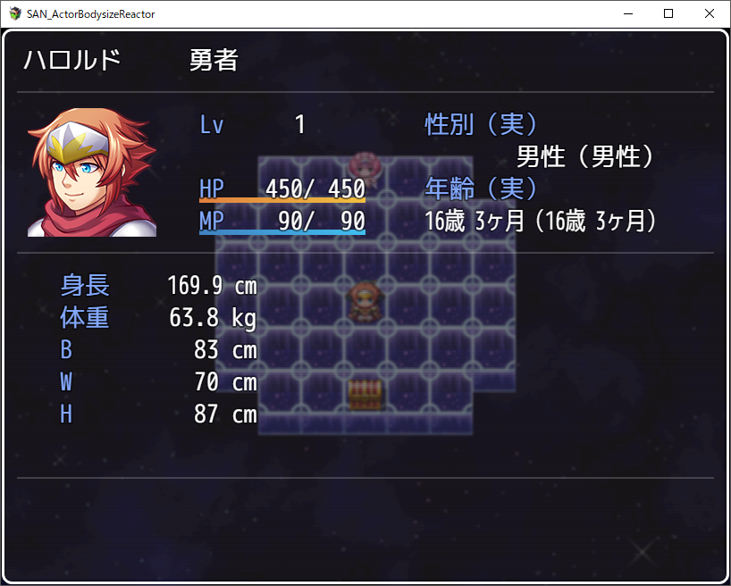
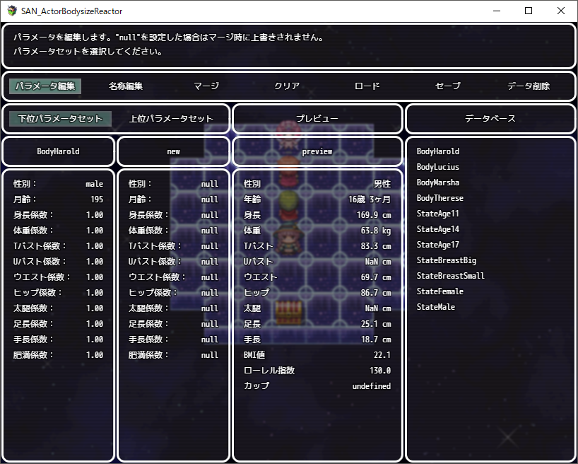
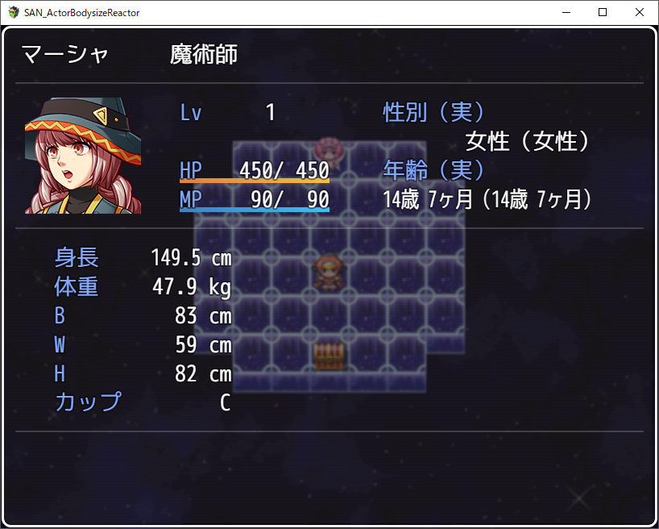
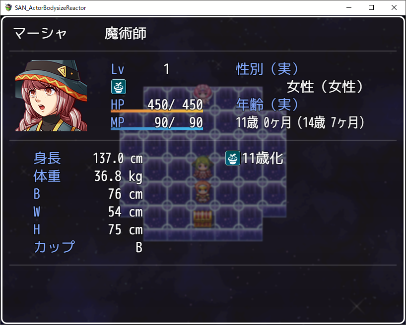

# SAN_ActorBodysizeReactor
このスクリプトはRPGツクールMV向けプラグインです。

## 概要
このプラグインには次の2つの機能を実装しています。

- ボディサイズ反映機能   
アクターに性別、年齢、身長、体重、スリーサイズ等のパラメータを追加し、
それらボディサイズに職業、装備、スキル、ステートを反映する機能です。

- データ編集機能   
ボディサイズ反映機能のデータを編集する機能です。

## 使い方
次のリンク先のファイルを保存してプラグインとして適用してください。
https://raw.githubusercontent.com/rev2nym/SAN_ActorBodysizeReactor/master/js/plugins/SAN_ActorBodysizeReactor.js   
また次のリンク先のファイルを保存して `./data` ディレクトリに配置してください。   
https://raw.githubusercontent.com/rev2nym/SAN_ActorBodysizeReactor/master/data/SAN_ActorBodysizeReactor.json   
詳細はプラグイン内のヘルプやサンプルプロジェクトを参考にしてください。   

## サンプルプロジェクト
次のダウンロードリンクからzipファイルをダウンロードして展開後に
新規プロジェクトに上書き保存してください。   
https://github.com/rev2nym/SAN_ActorBodysizeReactor/archive/master.zip

## デモ
- ボディサイズデータセットの編集

  
- ステートによるボディサイズの変化

  

## 利用規約
MITライセンスのもと、商用利用、改変、再配布が可能です。
ただし冒頭のコメントは削除や改変をしないでください。
これを利用したことによるいかなる損害にも作者は責任を負いません。
サポートは期待しないでください＞＜。  
